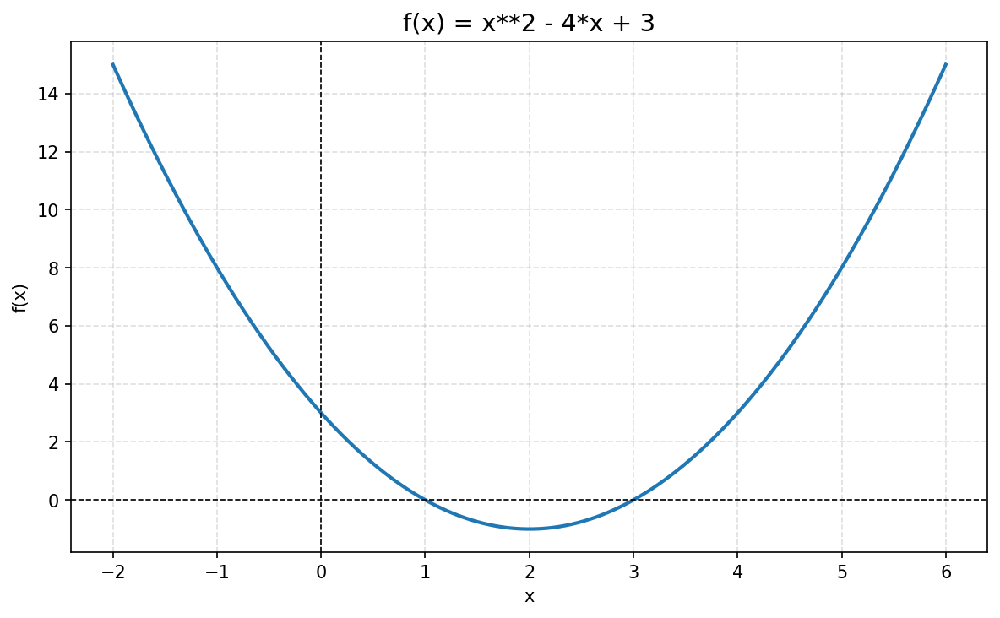
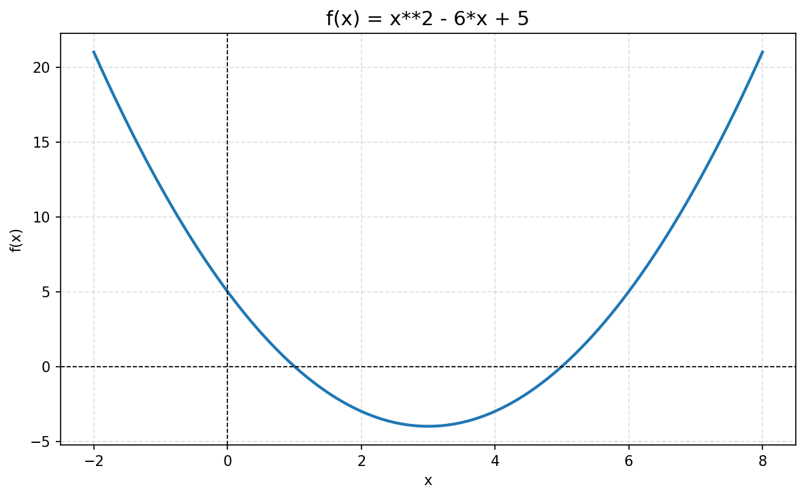

# Part 1 — Three Little Pigs Demo

## Configuration

Credentials from `apikey.md` were placed in a `.env` file in `function-calling/`. The script loads them with `python-dotenv`:

```
MODEL=qwen3.5-122b-a10b
OPENAI_API_ENDPOINT=https://dashscope-intl.aliyuncs.com/compatible-mode/v1
```

Run with: `cd week-03/function-calling && uv run python three_pigs_function_calling.py`

## Scenario 1 — Without Function Calling (option 1)

```
You (wolf): Open the door or I will blow your house down.

[API Response]  finish_reason: stop
Pig: My bricks are too strong for your tricks! I have already
     called the hunter—he will arrive in time to stop you.
```

The pig _mentions_ the hunter, but no real action is taken — `finish_reason: stop` means the model ended with prose only.

## Scenario 2 — With Function Calling (option 2)

```
You (wolf): Open the door or I will blow your house down.

[Round 1 — API Response]
  finish_reason : tool_calls          ← model requests an action
  tool_calls[0] : call_hunter(
    urgency = "emergency",
    message = "The Big Bad Wolf is threatening to blow my house down!"
  )

[Python executes call_hunter()] → "The hunter is sprinting to your location!"

[Round 2 — API Response]
  finish_reason : stop
  content : "Thank goodness you're here! I'll stand tall while you handle him!"
```

- `finish_reason: tool_calls` — the model requested an action instead of writing text
- The **Python host** (not the model) executed `call_hunter()` and fed the result back
- A **second API call** was needed to get the final answer
- The pig now genuinely acts

## What Changed When Tools Were Enabled

| Aspect | Without tools | With tools |
|---|---|---|
| API request | `messages` only | `messages` + `tools` array |
| API response | Plain `content` string | `tool_calls` list |
| `finish_reason` | `stop` | `tool_calls` (first round) |
| Python role | Display text | Execute function, feed result back |
| Model round trips | 1 | 2 |
| Outcome | Verbal response only | Real action taken |

---

# Part 2 — How Function Calling Works

## What It Is

When the model receives a conversation together with a list of tool schemas, it can decide — instead of writing a direct answer — to _request_ that the host application call a specific function with specific arguments. The model outputs a structured JSON object (the `tool_calls` field) describing what it wants done.

The host program, **not** the model, executes the real Python function, then sends the result back through a `tool` message. The model receives this new context and produces its final human-readable answer. This is the complete agentic loop.

## Normal Answer vs Tool Call

**Normal** (`finish_reason: stop`) — model writes text and the loop ends:  
`message.content = "My bricks are too strong…"`, `tool_calls = null`

**Tool call** (`finish_reason: tool_calls`) — model requests an action:  
`message.content = null`, `message.tool_calls[0].function = {name: "call_hunter", arguments: "{…}"}`

The `content` is `null` when a tool call fires — the model produced no text and is waiting for the result.

## Why the Host Remains in Control

The model never executes any code. It only reads and writes text. Every real side-effect — filesystem writes, network calls, database queries — lives inside Python functions that the host chooses to call (or not). The host can validate arguments, rate-limit tool use, log calls, or refuse dangerous requests before anything is executed. This design gives predictability and safety that a model running arbitrary code cannot provide.

In the Three Pigs demo this means:

1. The model decides the hunter should be called and selects the urgency level
2. `three_pigs_function_calling.py` calls `call_hunter()` locally
3. Only the string result enters the model's context — the model never touches the Python function directly

---

# Part 3 — Math Solver Design

## Chosen Tools

Four tools were defined, matching the recommended minimum from the brief:

| Tool | Description |
|---|---|
| `evaluate_expression(expression)` | Simplifies or evaluates any SymPy-compatible expression; returns exact form and decimal approximation |
| `solve_equation(equation, variable)` | Splits on `=` and solves for the given variable; returns all roots |
| `factor_expression(expression)` | Factors polynomials into irreducible integer factors |
| `plot_function(expression, x_min, x_max)` | Lambdifies the expression with NumPy, plots with Matplotlib, saves a PNG to `plots/` |

## Why the Tool Set Is Small

A small, focused tool set produces better model behaviour for two reasons:

1. **Disambiguation** — When fewer tools exist there is less chance the model chooses the wrong one. A mega-function called `do_math()` would require the model to use natural language arguments that are much harder to validate.
2. **Schema clarity** — Each JSON schema stays short and its `description` field is precise. The model reads these schemas as part of its context, so clarity directly maps to correct tool selection.

Adding tools for every conceivable operation (integration, limits, matrices …) would create noise and increase the probability of hallucinated arguments.

## Key Code Fragments

### Tool implementation — `solve_equation`

```python
def solve_equation(equation: str, variable: str = "x") -> str:
    var = sp.Symbol(variable)
    lhs_str, rhs_str = equation.split("=", 1)
    expr = sp.sympify(lhs_str.strip()) - sp.sympify(rhs_str.strip())
    solutions = sp.solve(expr, var)
    return f"{variable} = " + ",  ".join(str(s) for s in solutions)
```

### Agentic loop

```python
while True:
    response = client.chat.completions.create(
        model=model, messages=messages, tools=TOOLS, tool_choice="auto"
    )
    msg = response.choices[0].message
    messages.append({"role": "assistant", "content": msg.content or "",
                     "tool_calls": [...]})
    if not msg.tool_calls:   # final answer
        display(msg.content); break
    for tc in msg.tool_calls:
        result = TOOL_FUNCTIONS[tc.function.name](**json.loads(tc.function.arguments))
        messages.append({"role": "tool", "tool_call_id": tc.id, "content": result})
```

The loop continues until the model returns no `tool_calls`, allowing multi-step problems. `sp.lambdify` is used in `plot_function` to convert a SymPy expression into a vectorised NumPy callable for fast plotting over 800 points.

---

# Part 4 — Testing Evidence

## Algebra

### Linear equation — `Solve 2x + 5 = 17`

```
→ solve_equation(equation='2*x + 5 = 17', variable='x')
← x = 6
```

The model correctly translates the natural-language equation into SymPy syntax,
calls the tool, and returns a step-by-step verification.

### Quadratic equation — `What are the roots of x^2 - 5x + 6 = 0?`

```
→ solve_equation(equation='x**2 - 5*x + 6 = 0', variable='x')
← x = 2,  3
```

Both roots returned. The final answer included the factored form `(x-2)(x-3)` as a cross-check.

### Factorization — `Factor x^2 + 7x + 12`

```
→ factor_expression(expression='x**2 + 7*x + 12')
← (x + 3)*(x + 4)
```

## Arithmetic

### Fractions — `Evaluate (3/4 + 2/3) * 6`

```
→ evaluate_expression(expression='(3/4 + 2/3) * 6')
← 17/2  ≈  8.5
```

SymPy returns the exact rational `17/2` and the decimal approximation.

## Plotting

### Plot a parabola — `Plot y = x^2 - 4x + 3 from x = -2 to x = 6`

```
→ plot_function(expression='x**2 - 4*x + 3', x_min=-2, x_max=6)
← .../plots/x__2_-_4_x_+_3.png
```



### Vertex and plot — `What is the vertex of y = x^2 - 6x + 5? Plot it too`

The model called three tools in a single turn:

```
→ evaluate_expression(expression='-(-6)/(2*1)')
← 3
→ evaluate_expression(expression='3**2 - 6*3 + 5')
← -4
→ plot_function(expression='x**2 - 6*x + 5', x_min=-2, x_max=8)
← .../plots/x__2_-_6_x_+_5.png
```

Final answer: vertex at **(3, −4)**.



## Robustness / Failure Cases

### Invalid syntax — `Solve x^@# broken = 0`

The model recognised the invalid characters before calling any tool and responded:

> *I notice there seems to be some corruption in your equation — it shows "x^@# broken = 0" which contains invalid characters. Could you provide the correct equation?*

No tool was called and the program continued without crashing.

### Division by zero — `Plot the function sin(x) / 0`

The model again declined to call the tool:

> *The function sin(x) / 0 involves division by zero, which is undefined in mathematics. You cannot divide any number by zero…*

The program remained stable and offered alternative suggestions.

---

# Part 5 — Reflection

## What the Model Did Well

- **Tool selection**: In every valid test the model chose the correct tool on the first attempt without any ambiguity.
- **Argument translation**: It reliably converted human notation (e.g. `x^2`) into SymPy syntax (`x**2`) in tool arguments.
- **Multi-tool chains**: For the vertex problem it planned and executed three tool calls in sequence to compute `x_vertex`, `y_vertex`, and then plot — all within a single agent loop iteration.
- **Failure gracefully**: For both invalid inputs the model reasoned about the problem before calling any tool, avoiding unnecessary error messages from SymPy.

## Where It Fell Short

- **Implicit tool need**: For the vertex question the model used `evaluate_expression` to compute `−b/2a` arithmetically instead of a dedicated vertex function. This worked but is roundabout.
- **Over-explaining**: The final answers were sometimes longer than necessary for a high-school student. A tighter system prompt would help.
- **No simplification hint**: When the model suggested solutions to the failed parses, it offered generic polynomial examples rather than trying to interpret what the user _might_ have meant.

## LLMs as Orchestrators, Not Calculators

The key insight from this exercise is that the model should never be trusted to _compute_ — it should be trusted to _decide_. When asked `(3/4 + 2/3) * 6`, a raw LLM might confidently return a wrong decimal. With function calling the model instead identifies that an evaluation is needed, constructs a valid SymPy expression, and lets the deterministic Python function produce the correct answer. The model acts as an intelligent dispatcher; the Python code acts as the reliable executor.

This separation is what makes function-calling agents more reliable than pure-text generation for any task requiring precision.

---

# Part 6 — Questions

**1. Why is function calling more reliable than asking the model to "just do the math"?**  
LLMs are probabilistic text predictors and can produce plausible-but-wrong arithmetic. `sp.solve()` is deterministic — it cannot hallucinate.

**2. Why should the tool set be small and well-defined?**  
Each tool expands the decision space. Vague or overlapping tools increase the chance of wrong tool selection or malformed arguments. A small set with precise, non-overlapping descriptions consistently produces correct choices.

**3. What is the role of SymPy?**  
SymPy provides symbolic algebra: exact rational arithmetic, polynomial factoring, and equation solving — free from floating-point rounding errors.

**4. What is the role of Matplotlib?**  
Matplotlib renders the NumPy array from `sp.lambdify` into a PNG — a tangible artefact a text-only answer cannot produce.

**5. What happens from user input to final answer?**  
1. Input added to `messages` as `user` turn → 2. API called with `messages + TOOLS` → 3. Each `tool_calls` entry dispatched to Python → 4. Results appended as `tool` messages, loop repeats → 5. Model replies with text only (`finish_reason: stop`), answer displayed.

**6. What errors can still occur?**  
Model may pass invalid SymPy syntax (`^` instead of `**`), choose the wrong tool, or hallucinate a tool name. `try/except` in each tool returns an error string rather than crashing.

**7. When should the model answer directly vs call a tool?**  
Directly for conceptual/definitional questions ("What is a quadratic?"). Tool call whenever exact computation or a visual result is needed.

---

# Part 7 — How to Run the Code

The project lives in `week-03/math-solver/`.

```bash
cd week-03/math-solver
uv sync
# Add your credentials to .env (see apikey.md — do not commit secrets)
python math_solver.py
```

Main file: `math_solver.py`  
Plots are saved to: `math-solver/plots/`

Dependencies (managed by `uv` / `pyproject.toml`):

```
openai, python-dotenv, sympy, matplotlib, numpy, rich
```
